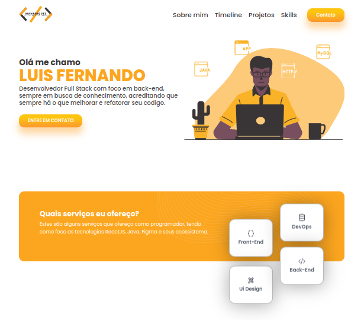

<div align="center">
<h2>ESTUDADEV</h2>

<!---Esses são exemplos. Veja https://shields.io para outras pessoas ou para personalizar este conjunto de escudos. Você pode querer incluir dependências, status do projeto e informações de licença aqui--->


</div>

<div align="center">

</div>
<br />
<h2>Instalando Projeto 🚀</h2>

Para instalar o projeto, siga estas etapas:

Clonar projeto:
```
git clone https://github.com/Manrriquez/portfolio-manrriquez
```

Entrar na raiz do projeto:
```
cd portfolio-manrriquez
```

Instalar Dependencias:
```
npm install
```

<h2>Startando o projeto ☕</h2>

Para usar portfolio-manrriquez, siga estas etapas:

Iniciar projeto:
```
npm run dev
```

Entre no navegador e digite o url:
```
http://localhost:5173/
```


## 📝 Licença

Esse projeto está sob licença. Veja o arquivo [LICENÇA](LICENSE.md) para mais detalhes.

[⬆ Voltar ao topo](#nome-do-projeto)<br>
